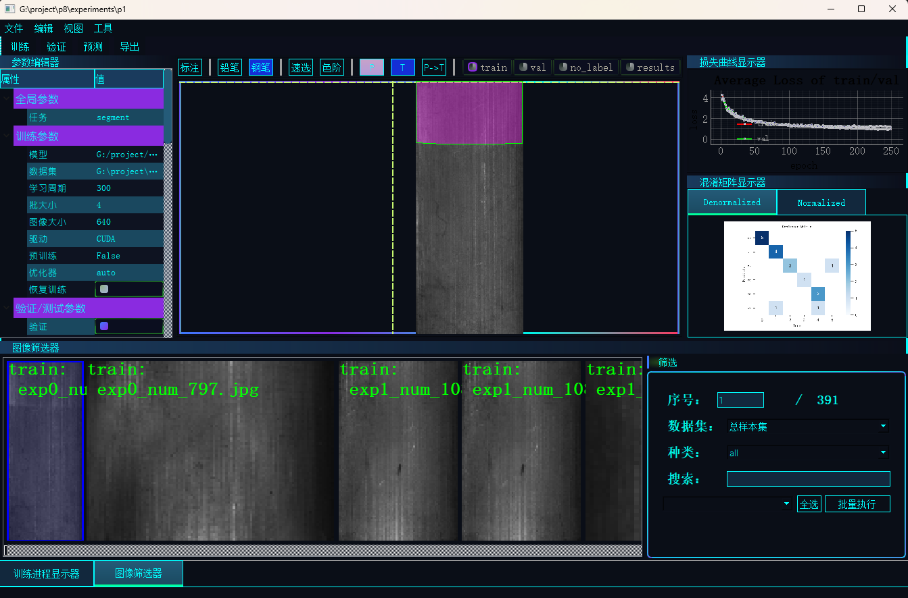

[](LICENSE)
[](https://www.python.org/)
[](https://wiki.qt.io/Qt_for_Python)
🚀[](https://ultralytics.com)

# OpenLY
The YOLO series is interfaced with PySide2 to realize functions such as training,validate, prediction, export, annotation, etc.  



## 许可证说明 █
- 本项目采用 [AGPL-3.0 许可证](LICENSE)
- 基于 YOLO 的功能继承其 [AGPL-3.0 授权](https://www.gnu.org/licenses/agpl-3.0)
- 根据 AGPL 要求：
  - 任何修改后的代码必须开源
  - 通过网络提供服务时必须公开源代码
  - 分发软件需包含完整源代码

## 功能特性

+ 提供层级化参数树状图展示（可编辑）
1、 参数编辑
2、 隐藏非重要参数，降低训练复杂度

+ 多模态训练看板  
1、 动态损失曲线群组（训练/验证损失同屏对比）  
2、 模型训练指标模仿（mAP50-95、精度/召回率动态迁移）  
3、 混淆矩阵指标跟踪（支持指标文件筛选）  

+ 数据集全任务兼容架构  
1、 YOLO多模态数据解析器（Detect/Segment/OBB/Classify/Keypoints）  
2、 智能转换器（自带转换工具转换COCO/VOC/YOLO格式）  
3、 实时编辑（修改、添加、删除、转换）
4、 动态筛选（数据集筛选、种类筛选、名称筛选）
5、 快速选择（threshold、floodfill、grabcut）
6、 半自动标注（模型预测标签转真实标签）

## 快速开始 
# ***安装前请确认理解 AGPL义务***

### 安装步骤（新增合规提示） █
```bash
git clone https://github.com/Q-qqq/OpenLY.git
cd your-project
```